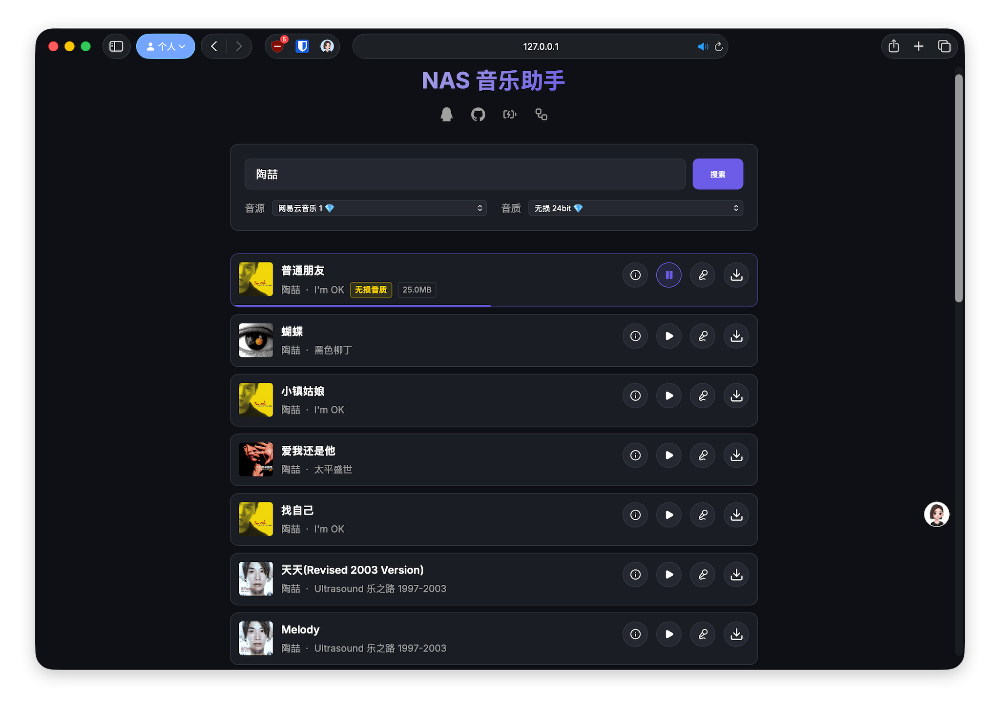
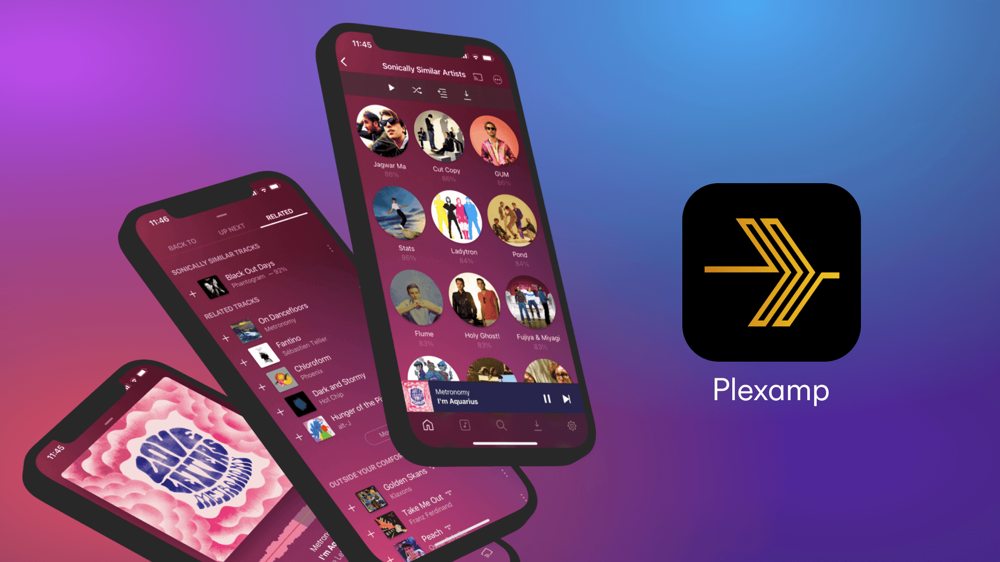

# NAS 音乐助手
本项目基于 [GD 音乐台](https://music.gdstudio.org) 和 [BugPk-Api](https://api.bugpk.com/doc-163_music.html) 提供的 API（后续可能支持其他公开或自建 API），使用网页搜索或快捷指令，一键把喜欢的音乐入库 NAS。  



## ✨ 功能特色
- 支持 PWA 网页，搜索多平台、高品质音乐
- 支持 API / 快捷指令，一键分享并下载
- 内嵌 ID3 标签，方便自动匹配元数据
- 自动入库 Plex、Emby、Navidrome 等媒体库

## 📝 功能规划
- [ ] 歌单、专辑批量下载

## 🎵 NAS 音乐方案
顺便分享下我的自用方案，几乎`全平台`制霸了，但我不是发烧友，音乐爱好者可参考吧。此方案涉及的所有工具基础功能`完全免费`，目前可实现一键入库，自动匹配音乐元数据。



- 媒体库（服务端）：[Plex](https://www.plex.tv/media-server-downloads)
  - Win、Mac、Linux（NAS 套件、Docker）、Android 等
- 播放器（客户端）：[Plexamp](https://www.plex.tv/plexamp/)
  - Win、Mac、Linux（树莓派、Docker）、iOS、Android、网页、车机等
  - 支持多设备推送、控制播放等
- 元数据管理：
	- 自动匹配：[Plex 网易云插件](https://github.com/timmy0209/WangYiYun.bundle)
	- 增强匹配：[Music Tag Web 音乐标签](https://github.com/xhongc/music-tag-web)
- 多房间播放：
	- AirPlay 2：[Shairport Sync](https://github.com/mikebrady/shairport-sync)
	- 我开发的另一个项目：[Plexamp-Cast](https://github.com/juneix/plexamp-cast)

## 🧩 快速部署
```yaml
services:
  nas-music-kit:
    image: ghcr.io/juneix/nas-music-kit
    # image: docker.1ms.run/juneix/nas-music-kit  # 毫秒镜像加速
    container_name: nas-music-kit
    network_mode: host
    restart: unless-stopped
    environment:
      - PORT=8848 #自定义端口号
    volumes:
      # - /vol1/1000/music:/music # 飞牛示例
      # - /volume1/music:/music # 群晖示例
      - ./music:/music #映射你的 NAS 音乐文件夹
```

## ⚠️ 注意事项
> 低调使用，请勿在国内论坛、社群公开传播此项目。😅
- API 访问频率限制（动态更新）：5 分钟内不超 50 次请求
- 如果依然无法使用，请前往原作者 API 站点查看原因

## ❤️ 支持项目
- 打赏鼓励：支持我开发更多有趣应用
- 互动群聊：加入 💬 [QQ 群](https://qm.qq.com/q/ZzOD5Qbhce) 可在线催更
- 更多内容：访问 ➡️ [谢週五の藏经阁](https://5nav.eu.org)

<div align="center">
  <table>
    <tr>
      <td align="center">
        <br/>
        <sub>微信</sub>
      </td>
      <td align="center">
        <br/>
        <sub>支付宝</sub>
      </td>
    </tr>
  </table>
</div>